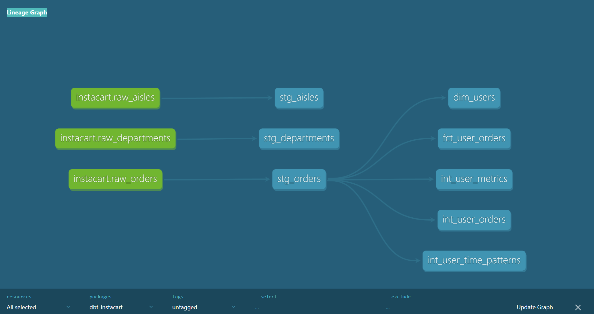
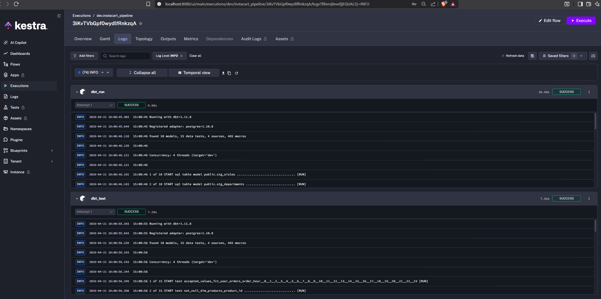
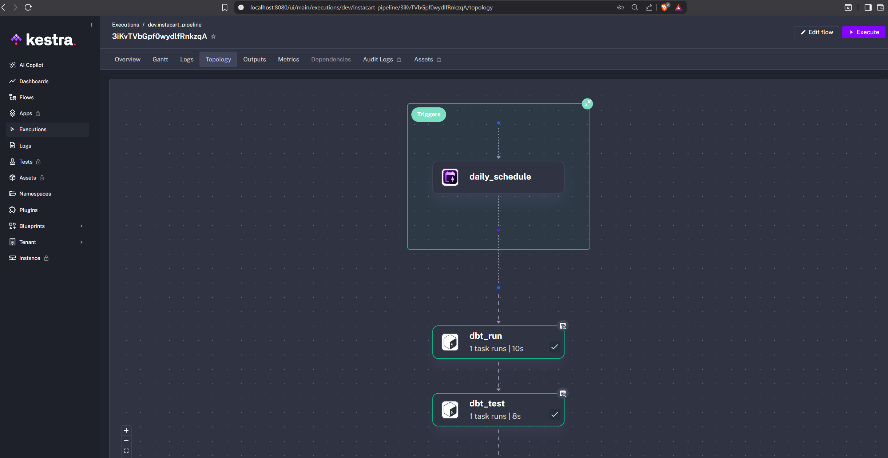

# Instacart End-to-End Data Platform
This project simulates a modern analytics engineering workflow: ingesting raw e-commerce data into Postgres, transforming it with dbt into layered models, and orchestrating pipeline execution with Kestra. It demonstrates staging, intermediate modeling, marts, data quality checks, incremental processing, and workflow automation.

## Overview
Built an end-to-end batch data platform on the Instacart dataset using Postgres, dbt, and Kestra. The pipeline ingests raw data, transforms it into analytics-ready models, and orchestrates execution and testing through Kestra.

## Tech Stack
- Postgres - data warehouse
- dbt - data transformation and modeling
- Kestra - orchestration
- Docker - containerization
- Python(pandas) - ingestion

## Architecture
[screenshots/architecture.png]

Raw CSV → Postgres → dbt (staging → intermediate → marts) → Kestra → validated tables

## Data Lineage

The dbt lineage graph can be found at:

## Data Model
### Staging
- stg_orders
- stg_products
- stg_aisles
- stg_departments

### Intermediate
- int_user_orders
- int_user_metrics
- int_user_time_patterns

### Marts
- fct_user_orders
- dim_users
- dim_products

## Orchestration
Kestra flow lives in `kestra/flows/instacart_pipeline.yml`

Pipeline:
- dbt run
- dbt test

## Data Quality
- not_null tests
- unique tests
- accepted_values on order_hour

## How to Run
1. docker compose up -d
2. run dbt
3. go to http://localhost:8080
4. execute Kestra flow: instacart_pipeline

## Sample Business Questions
- When do users tend to place orders?
- How frequently do users reorder?
- What product hierarchy exists across aisles and departments?

## What I could improve on this project
- add CI/CD
- add real-time ingestion
- publish dbt docs

## Pipeline Runs

## To generate dbt Documentation
docker exec -it kestra sh -c "cd /app/dbt_instacart && dbt docs generate --profiles-dir /app/dbt_instacart"

## Project Structure
.
├── dbt_instacart/
├── data_ingestion/
├── kestra/
│   └── flows/
├── screenshots/
├── docker-compose.yml
├── Dockerfile
└── README.md